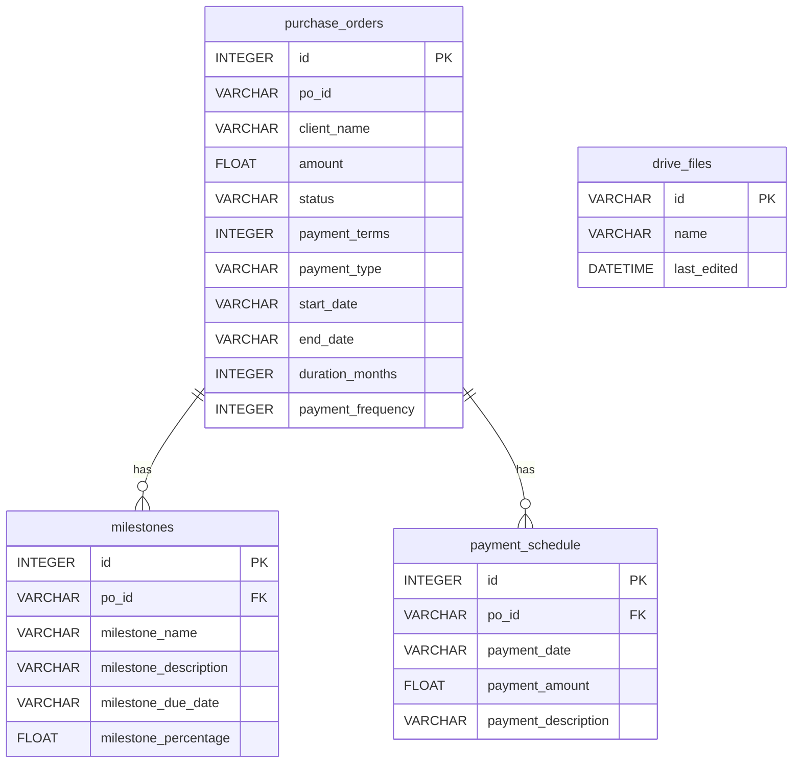

## ER Diagram

```mermaid
erDiagram
    purchase_orders {
        INTEGER id PK
        VARCHAR po_id
        VARCHAR client_name
        FLOAT amount
        VARCHAR status
        INTEGER payment_terms
        VARCHAR payment_type
        VARCHAR start_date
        VARCHAR end_date
        INTEGER duration_months
        INTEGER payment_frequency
    }

    milestones {
        INTEGER id PK
        VARCHAR po_id FK
        VARCHAR milestone_name
        VARCHAR milestone_description
        VARCHAR milestone_due_date
        FLOAT milestone_percentage
    }

    payment_schedule {
        INTEGER id PK
        VARCHAR po_id FK
        VARCHAR payment_date
        FLOAT payment_amount
        VARCHAR payment_description
    }

    drive_files {
        VARCHAR id PK
        VARCHAR name
        DATETIME last_edited
    }

    purchase_orders ||--o{ milestones : "has"
    purchase_orders ||--o{ payment_schedule : "has"
```